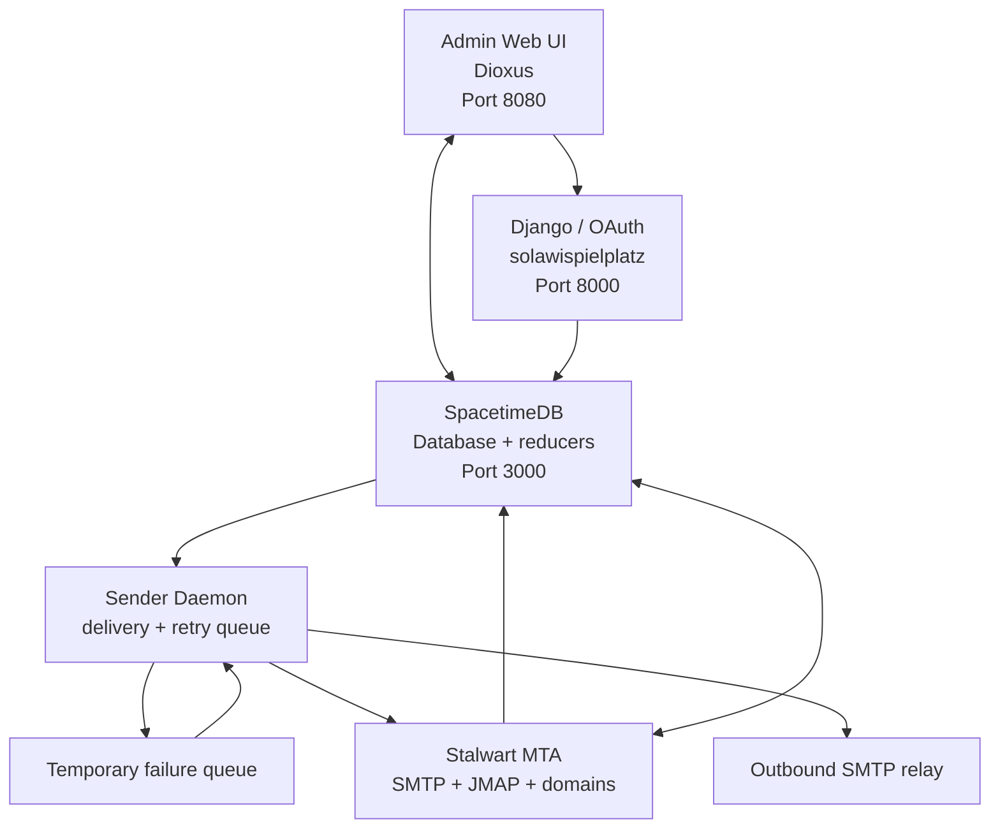

# Kommunikationszentrum - SoLaWi Email Management System

A Community Supported Agriculture (SoLaWi) email management system that processes and routes emails based on user subscriptions to mailing list categories.

The main documentation is available at: [](https://enaut.github.io/kommunikationszentrum/)

## Quick Start

### Service Management
It could make sense to create local zed tasks to start spacetimedb and solawis in the user settings (ctrl+shift+p→open tasks) see also: https://enaut.github.io/kommunikationszentrum/setup/installation.html.

#### Externals
1. start Django-Solawis
1. start SpacetimeDB

#### Zed tasks
Some zed-editor tasks are defined in the project settings:

1. "Publish spacetime module"
1. "Start Sender" (Starting the email sender that interacts with stalwart and spacetimedb)
1. "Start Grafana" (Starting Grafana for log reading)
1. "Start Dioxus" (Starting the admin interface)
1. "Serve Docs" (Optional to read the docs)

### Environment Variables

In the `.env` directory are some example files for the different purposes. Rename `*.example` to `*` and adjust the values as needed.

```bash
cp .env.example .env
```

## Current Architecture

The system is organized around four cooperating layers:

- Django provides user identity, OAuth, and membership data.
- Stalwart owns the mail transfer layer, domain inventory, and mailbox provisioning.
- SpacetimeDB stores the canonical routing state, subscriptions, and delivery pipeline.
- The sender daemon claims outbound work, sends mail, and retries transient SMTP failures.



### Components

1. **SpacetimeDB Server** (`/server`): canonical state for accounts, categories, subscriptions, domains, and delivery jobs
2. **Admin Web Interface** (`/admin`): Dioxus frontend for member and admin workflows
3. **Sender Daemon** (`/sender`): SMTP delivery worker with retry, lease expiry, and queue recovery
4. **External integrations**: Django OAuth/user sync and Stalwart MTA/domain management

## Manual Setup

### Prerequisites

- [Rust](https://rustup.rs/) with `wasm32-unknown-unknown` target
- [SpacetimeDB CLI](https://spacetimedb.com/install)
- [Dioxus CLI](https://dioxuslabs.com/learn/0.6/getting_started): `cargo install dioxus-cli`

### Manual Service Startup

If you prefer to start services individually:

#### 1. Start SpacetimeDB Server

```bash
spacetime start
```

#### 2. Publish Database Schema

```bash
spacetime publish --project-path server kommunikation
```

#### 3. Start Django Backend

```bash
/home/dietrich/.envs/Solawis/current/bin/python /home/dietrich/Projekte/Source/solawispielplatz/src/manage.py runserver
```

#### 4. Start Admin Web UI

```bash
dx serve --package admin --platform web
```

#### 5. Sync Users to SpacetimeDB

```bash
cd /home/dietrich/Projekte/Source/solawispielplatz
/home/dietrich/.envs/Solawis/current/bin/python src/manage.py sync_users_to_spacetimedb
```

## Documentation

Complete documentation is available in the `docs/` directory:

```bash
# Start documentation server
cd docs && mdbook serve --open
```
