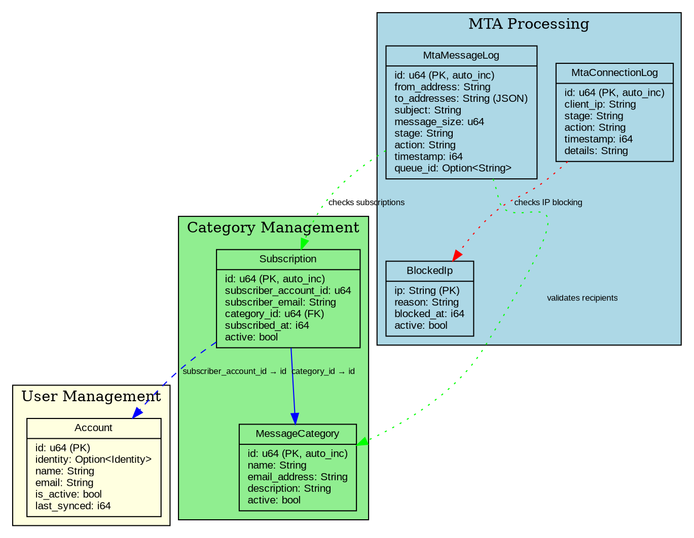
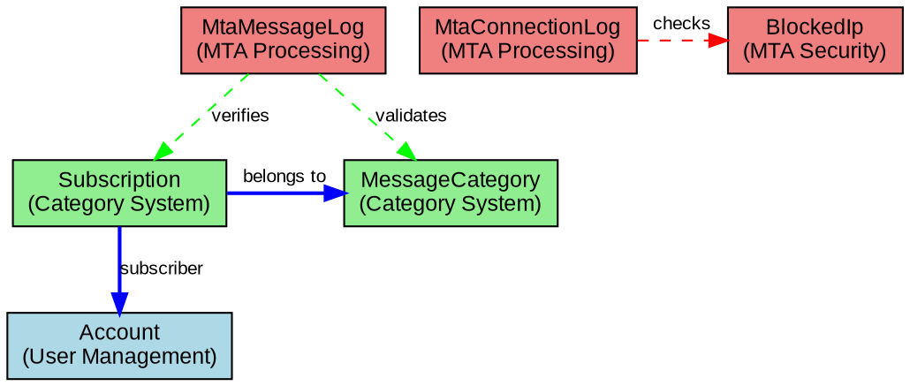
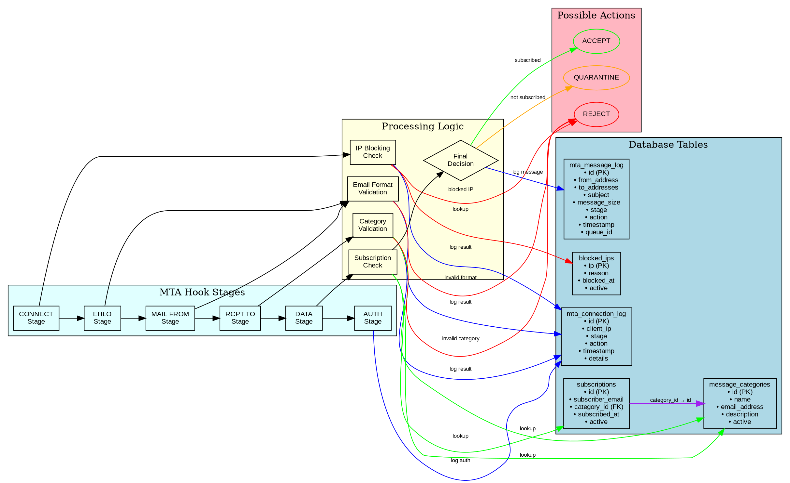

# Database Diagrams

This appendix contains all database diagrams for the Kommunikationszentrum SpacetimeDB schema with detailed explanations.

## Complete Database Schema



The complete database schema diagram shows:

- **All tables** with their field names and data types
- **Primary keys** (PK) and auto-increment fields
- **Foreign key relationships** with solid blue arrows
- **Logical relationships** with dashed blue arrows
- **Functional grouping** of tables by color

### Table Groups by Color

- **Yellow (User Management)**: `account`
- **Green (Category Management)**: `message_categories`, `subscriptions`
- **Blue (MTA Processing)**: `mta_connection_log`, `mta_message_log`, `blocked_ips`

## Simplified Entity-Relationship Diagram



The simplified ER diagram focuses on the core relationships:

- **Clear entity boxes** with primary functional areas
- **Relationship lines** showing connections
- **Reduced complexity** for quick understanding
- **Color coding** by functional area

### Key Relationships

- `subscriptions.category_id` → `message_categories.id` (Foreign Key)
- `subscriptions.subscriber_account_id` → `account.id` (Logical relationship)
- MTA log tables are independent audit tables

## MTA Processing Flow



The MTA processing flow diagram illustrates:

### Processing Stages

1. **CONNECT** (Start): Initial connection validation
   - IP blocking check against `blocked_ips` table
   - Decision: ACCEPT or REJECT

2. **EHLO**: Extended HELO validation
   - Basic protocol validation
   - HELO string format check

3. **MAIL FROM**: Sender validation
   - Email address format validation
   - Future: Sender whitelist/blacklist

4. **RCPT TO**: Recipient validation
   - Category validation against `message_categories`
   - REJECT if category doesn't exist

5. **DATA**: Full message processing
   - Subscription validation against `subscriptions` table
   - Final ACCEPT/REJECT/QUARANTINE decision

6. **AUTH**: Authentication (currently accept-all)

### Decision Points

Each stage can result in:
- **ACCEPT** (Green): Continue to next stage
- **REJECT** (Red): Reject email immediately  
- **QUARANTINE** (Orange): Hold for manual review

### Database Interactions

- **Lookups**: Read from `blocked_ips`, `message_categories`, `subscriptions`
- **Logging**: Write to `mta_connection_log` and `mta_message_log`
- **Privacy**: IP addresses redacted in logs as "[REDACTED]"

## Using mdbook-graphviz

All diagrams in this documentation are rendered using mdbook-graphviz, which processes DOT code blocks directly. This means:

### Advantages
- **No image files needed**: Diagrams are generated at build time
- **Always up-to-date**: Diagrams can't become stale
- **Scalable**: SVG output scales perfectly
- **Version controlled**: DOT source is in git with the documentation

### Updating Diagrams
To update any diagram, simply edit the DOT code in the markdown file and rebuild the documentation:

```bash
cd docs
mdbook build
# or for live preview:
mdbook serve
```

### DOT Syntax Reference
The diagrams use Graphviz DOT syntax. Key elements:

- **Nodes**: `node_name [label="Display Text", shape=box, fillcolor=lightblue];`
- **Edges**: `node1 -> node2 [label="Relationship", color=red];`
- **Subgraphs**: `subgraph cluster_name { label="Group Name"; node1; node2; }`
- **Styling**: Colors, shapes, fonts, and layout options

For more complex diagrams, refer to the [Graphviz documentation](https://graphviz.org/doc/info/lang.html).

The diagrams provide visual documentation that complements the textual descriptions and help developers understand the system structure at a glance.

### Processing Stages

1. **CONNECT** (Start): Initial connection validation
   - IP blocking check against `blocked_ips` table
   - Decision: ACCEPT or REJECT

2. **EHLO**: Extended HELO validation
   - Basic protocol validation
   - HELO string format check

3. **MAIL FROM**: Sender validation
   - Email address format validation
   - Future: Sender whitelist/blacklist

4. **RCPT TO**: Recipient validation
   - Category validation against `message_categories`
   - REJECT if category doesn't exist

5. **DATA**: Full message processing
   - Subscription validation against `subscriptions` table
   - Final ACCEPT/REJECT/QUARANTINE decision

6. **AUTH**: Authentication (currently accept-all)

### Decision Points

Each stage can result in:
- **ACCEPT** (Green): Continue to next stage
- **REJECT** (Red): Reject email immediately  
- **QUARANTINE** (Orange): Hold for manual review

### Database Interactions

- **Lookups**: Read from `blocked_ips`, `message_categories`, `subscriptions`
- **Logging**: Write to `mta_connection_log` and `mta_message_log`
- **Privacy**: IP addresses redacted in logs as "[REDACTED]"

## Diagram Source Files

All diagrams are generated from DOT files using Graphviz:

### Database Schema
- **Source**: [`database_schema.dot`](../images/database_schema.dot)
- **Generate PNG**: `dot -Tpng database_schema.dot -o database_schema.png`
- **Generate SVG**: `dot -Tsvg database_schema.dot -o database_schema.svg`

### Simple ER Diagram  
- **Source**: [`simple_er_diagram.dot`](../images/simple_er_diagram.dot)
- **Generate PNG**: `dot -Tpng simple_er_diagram.dot -o simple_er_diagram.png`
- **Generate SVG**: `dot -Tsvg simple_er_diagram.dot -o simple_er_diagram.svg`

### MTA Processing Flow
- **Source**: [`mta_processing_flow.dot`](../images/mta_processing_flow.dot)  
- **Generate PNG**: `dot -Tpng mta_processing_flow.dot -o mta_processing_flow.png`
- **Generate SVG**: `dot -Tsvg mta_processing_flow.dot -o mta_processing_flow.svg`

## Regenerating Diagrams

To update the diagrams after schema changes:

### Prerequisites
```bash
# Install Graphviz on your system
sudo dnf install graphviz    # Fedora
sudo apt install graphviz   # Ubuntu/Debian
brew install graphviz       # macOS
```

### Generate All Formats
```bash
cd docs/src/images

# Database Schema
dot -Tpng database_schema.dot -o database_schema.png
dot -Tsvg database_schema.dot -o database_schema.svg

# Simple ER Diagram
dot -Tpng simple_er_diagram.dot -o simple_er_diagram.png
dot -Tsvg simple_er_diagram.dot -o simple_er_diagram.svg

# MTA Processing Flow
dot -Tpng mta_processing_flow.dot -o mta_processing_flow.png
dot -Tsvg mta_processing_flow.dot -o mta_processing_flow.svg
```

### Batch Script
```bash
#!/bin/bash
# regenerate-diagrams.sh
cd docs/src/images

for dot_file in *.dot; do
    base_name="${dot_file%.dot}"
    echo "Generating ${base_name}..."
    dot -Tpng "${dot_file}" -o "${base_name}.png"
    dot -Tsvg "${dot_file}" -o "${base_name}.svg"
done

echo "All diagrams regenerated!"
```

## Using Diagrams in Documentation

### Markdown Image Embedding
```markdown

```

### Multiple Formats
```markdown
View as: [PNG](../images/diagram.png) | [SVG](../images/diagram.svg) | [Source](../images/diagram.dot)
```

### Responsive Images
For better responsive design, prefer SVG format when possible:
```markdown

```

The diagrams provide visual documentation that complements the textual descriptions and help developers understand the system structure at a glance.
