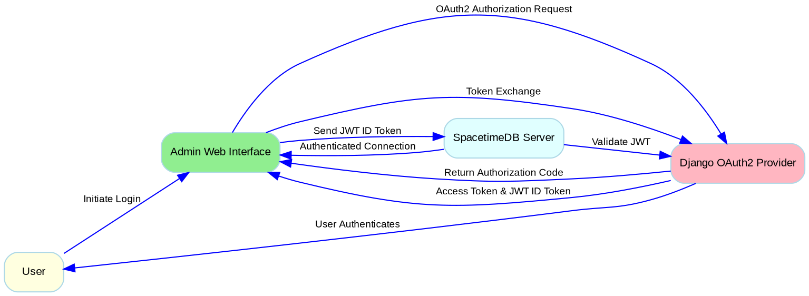

# Authentication & Security

The Kommunikationszentrum implements a comprehensive authentication and authorization system based on OAuth 2.0 with OpenID Connect (OIDC). The system provides secure access to the admin interface and protects SpacetimeDB operations through JWT-based authentication.

## System Overview

The authentication architecture integrates three core components:

- **Django OAuth2 Provider** (solawispielplatz): Issues JWT ID tokens via OpenID Connect
- **SpacetimeDB Server**: Validates JWT tokens and manages authenticated connections
- **Admin Web Interface**: Uses JWT tokens for authenticated database operations

## Key Features

**OAuth 2.0 with PKCE**: Secure authorization flow with Proof Key for Code Exchange to prevent authorization code interception attacks.

**OpenID Connect Integration**: JWT ID tokens contain user identity and permission claims from Django, providing seamless identity propagation.

**Real-time Authentication**: SpacetimeDB validates JWT tokens on connection establishment, enabling secure real-time database subscriptions.

**Role-based Access Control**: Different permission levels for regular users and administrators based on Django user roles.

## Authentication Flow

