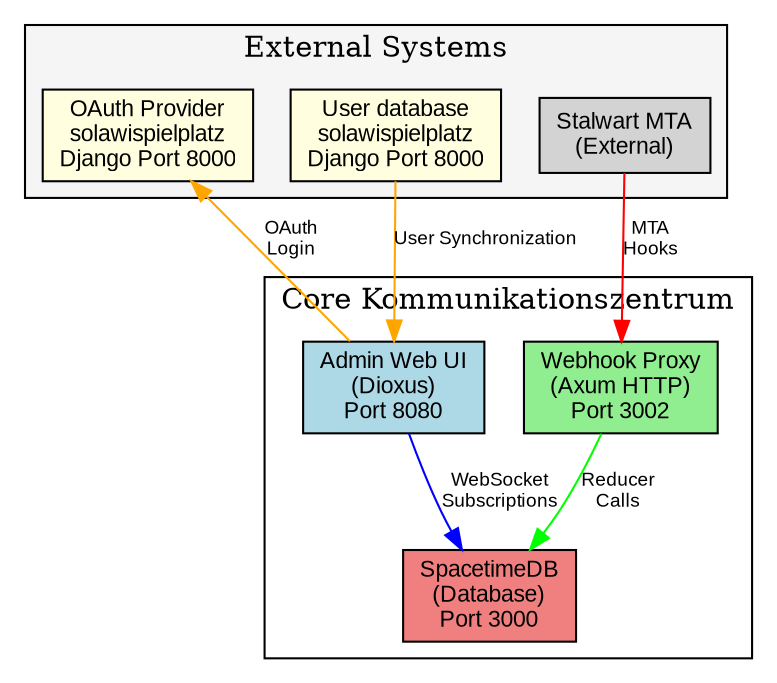
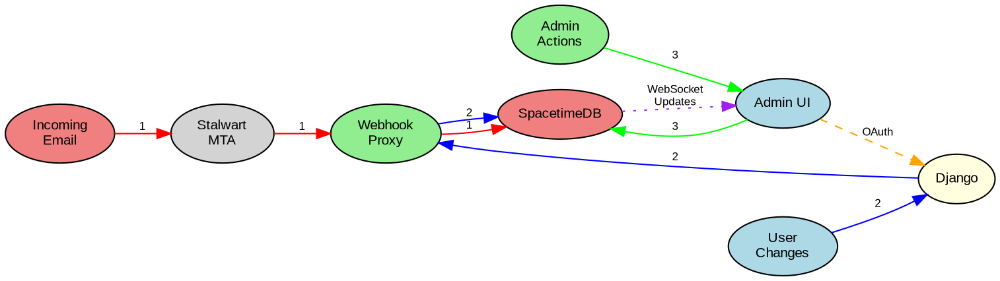
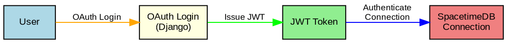

# Architecture

The Kommunikationszentrum consists of four main components that work together to provide email management for the SoLaWi project.

## System Overview

## Data Flow

**Legend:**
- **1: Email Processing** – Incoming emails are processed through Stalwart MTA, sent to the webhook proxy, and stored in SpacetimeDB.
- **2: User Management** – User changes are managed in Django, synchronized via the webhook proxy, and updated in SpacetimeDB.
- **3: Admin Interface** – Admin actions are performed in the Admin UI and reflected in SpacetimeDB.

## Components

### SpacetimeDB Server (`/server`)
- Database and business logic layer
- WASM modules with Rust reducers
- Real-time subscriptions for UI updates

### Webhook Proxy (`/webhook-proxy`)
- HTTP API gateway
- Translates HTTP requests to SpacetimeDB reducer calls
- Handles MTA hooks and user synchronization

### Admin Web Interface (`/admin`)
- Dioxus WebAssembly frontend
- OAuth authentication via Django
- Subscription management interface

### External Dependencies
- **Django solawispielplatz**: User management and OAuth provider
- **Stalwart MTA**: Email server that sends hooks to webhook proxy

## Authentication Flow

The system uses OAuth 2.0 with Django as the identity provider. JWT tokens are validated by SpacetimeDB for all authenticated operations.
