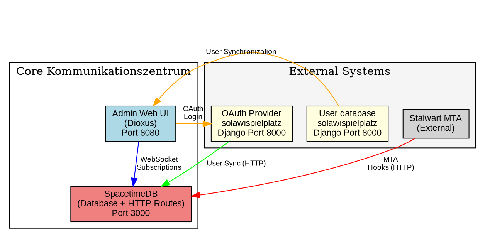
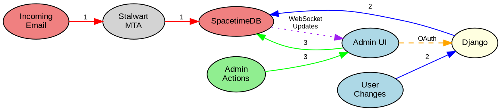
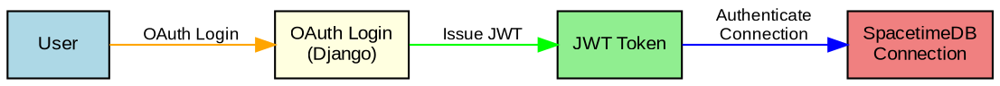

# Architecture

The Kommunikationszentrum consists of three main running components that work together to provide email management for the SoLaWi project.

## System Overview

```dot process
digraph system_architecture {
    // Graph settings
    rankdir=TB;
    node [shape=box, fontname="Arial", fontsize=11, style=filled];
    edge [fontname="Arial", fontsize=9];

    // Main components
    admin_ui [label="Admin Web UI\n(Dioxus)\nPort 8080", fillcolor=lightblue];
    spacetimedb [label="SpacetimeDB\n(Database + HTTP Routes)\nPort 3000", fillcolor=lightcoral];

    // External dependencies
    django [label="OAuth Provider\nsolawispielplatz\nDjango Port 8000", fillcolor=lightyellow];
    django_user [label="User database\nsolawispielplatz\nDjango Port 8000", fillcolor=lightyellow];
    stalwart [label="Stalwart MTA\n(External)", fillcolor=lightgray];

    // Connections
    admin_ui -> spacetimedb [label="WebSocket\nSubscriptions", color=blue];
    admin_ui -> django [label="OAuth\nLogin", color=orange];
    django_user -> admin_ui [label="User Synchronization", color=orange];
    stalwart -> spacetimedb [label="MTA\nHooks (HTTP)", color=red];
    django -> spacetimedb [label="User Sync (HTTP)", color=green];

    // Grouping
    subgraph cluster_core {
        label="Core Kommunikationszentrum";
        style=filled;
        fillcolor=white;
        admin_ui;
        spacetimedb;
    }

    subgraph cluster_external {
        label="External Systems";
        style=filled;
        fillcolor=whitesmoke;
        django;
        django_user;
        stalwart;
    }
}
```

## Data Flow

```dot process
digraph data_flow {
    // Graph settings
    rankdir=LR;
    node [shape=ellipse, fontname="Arial", fontsize=10, style=filled];
    edge [fontname="Arial", fontsize=8];

    // Data sources
    incoming_email [label="Incoming\nEmail", fillcolor=lightcoral];
    user_changes [label="User\nChanges", fillcolor=lightblue];
    admin_actions [label="Admin\nActions", fillcolor=lightgreen];

    // Processing components
    stalwart_mta [label="Stalwart\nMTA", fillcolor=lightgray];
    spacetimedb [label="SpacetimeDB", fillcolor=lightcoral];
    admin_ui [label="Admin UI", fillcolor=lightblue];
    django [label="Django", fillcolor=lightyellow];

    // Flow 1: Email Processing
    incoming_email -> stalwart_mta -> spacetimedb [label="1", color=red];

    // Flow 2: User Management
    user_changes -> django -> spacetimedb [label="2", color=blue];

    // Flow 3: Admin Interface
    admin_actions -> admin_ui -> spacetimedb [label="3", color=green];
    admin_ui -> django [label="OAuth", color=orange, style=dashed];

    // Real-time updates
    spacetimedb -> admin_ui [label="WebSocket\nUpdates", color=purple, style=dotted];
}
```

**Legend:**
- **1: Email Processing** – Incoming emails are processed by Stalwart MTA and delivered to SpacetimeDB via the module's HTTP routes where the delivery is validated and persisted.
- **2: User Management** – User changes are managed in Django and synchronized to SpacetimeDB over the module's user-sync HTTP route.
- **3: Admin Interface** – Admin actions are performed in the Admin UI and reflected in SpacetimeDB.

## Components

### SpacetimeDB Server (`/server`)
- Database and business logic layer
- WASM modules with Rust reducers and HTTP handlers
- Exposes module-specific HTTP routes under `/v1/database/:name/route/{*path}`
- Real-time subscriptions for UI updates

### Admin Web Interface (`/admin`)
- Dioxus WebAssembly frontend
- OAuth authentication via Django
- Subscription management interface

### External Dependencies
- **Django solawispielplatz**: User management and OAuth provider
- **Stalwart MTA**: Email server that posts stage hooks directly to the module HTTP routes

## Authentication Flow

```dot process
digraph authentication_flow {
    rankdir=LR;
    node [shape=box, fontname="Arial", fontsize=10, style=filled];
    edge [fontname="Arial", fontsize=9];

    user [label="User", fillcolor=lightblue];
    django [label="OAuth Login\n(Django)", fillcolor=lightyellow];
    jwt [label="JWT Token", fillcolor=lightgreen];
    spacetimedb [label="SpacetimeDB\nConnection", fillcolor=lightcoral];

    user -> django [label="OAuth Login", color=orange];
    django -> jwt [label="Issue JWT", color=green];
    jwt -> spacetimedb [label="Authenticate\nConnection", color=blue];
}
```

The system uses OAuth 2.0 with Django as the identity provider. JWT tokens are validated by SpacetimeDB for all authenticated WebSocket connections. External systems (MTA, Django sync) use module HTTP routes secured with bearer tokens and permissions.
