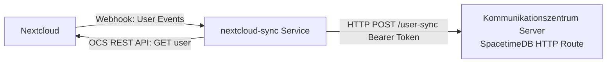

# Nextcloud User Synchronization Service (`nextcloud-sync`)

The `nextcloud-sync` service synchronizes user accounts one-way from Nextcloud to Kommunikationszentrum.

It enables administrators to pre-provision users and subscribe them to mailing list topics **before** they have logged in for the first time. When the user later logs in via OIDC, Kommunikationszentrum links the account using the matching `external_id == sub` (the Nextcloud username / UID).

---

## Architecture Overview



1. **Push (Webhooks):** Nextcloud sends real-time webhook events (user created, changed, deleted).
2. **Pull (OCS REST API):** The service fetches user details (display name, email, enabled status) from Nextcloud's OCS Provisioning API (`/ocs/v2.php/cloud/users/{uid}`).
3. **Upsert / Delete:** The service posts the normalized user data to the SpacetimeDB `user-sync` HTTP route using a webhook bearer token with `sync-user` permission.
4. **Reconciler / Initial Backfill:** Upon startup and periodically (e.g. every 6 hours), the service pages through all Nextcloud users to ensure complete synchronization and heal any missed webhook events.

---

## Environment Variables

| Variable | Required | Default | Description |
|---|---|---|---|
| `NC_URL` | ✓ | — | Base URL of Nextcloud (e.g. `https://cloud.example.org`). |
| `NC_USER` | ✓ | — | Nextcloud administrative user for OCS Provisioning API. |
| `NC_APP_PASSWORD` | ✓ | — | Nextcloud App Password generated for `NC_USER`. |
| `NC_WEBHOOK_SECRET` | ✓ | — | Shared secret token to validate incoming webhook requests. |
| `NC_SYNC_LISTEN_ADDR` | — | `0.0.0.0:8088` | Address and port for the incoming webhook HTTP listener. |
| `NC_RECONCILE_INTERVAL_SECS` | — | `21600` | Full reconciliation interval in seconds (default: 6 hours). |
| `SPACETIME_SYNC_URL` | ✓ | — | URL to Kommunikationszentrum `user-sync` route (e.g. `http://localhost:3000/v1/database/kommunikation/route/user-sync`). |
| `SPACETIME_WEBHOOK_TOKEN` | ✓ | — | Plaintext bearer token authorized for `sync-user`. |

---

## Nextcloud Setup

### 1. App Password
1. In Nextcloud, navigate to **Personal Settings** → **Security** → **Devices & sessions**.
2. Create a new app password named e.g. `kommunikationszentrum-sync`.
3. Set `NC_USER` to your username and `NC_APP_PASSWORD` to the generated password.

### 2. Nextcloud Webhook Listeners
Nextcloud (version 30+) provides the `webhook_listeners` app to send webhooks on core events:

```bash
# Register webhook listener for user created
occ webhook_listeners:register \
  --event="OCP\User\Events\UserCreatedEvent" \
  --url="https://sync.example.org/nextcloud/webhook" \
  --header="X-Nextcloud-Token: <your-webhook-secret>"

# Register webhook listener for user updated
occ webhook_listeners:register \
  --event="OCP\User\Events\UserChangedEvent" \
  --url="https://sync.example.org/nextcloud/webhook" \
  --header="X-Nextcloud-Token: <your-webhook-secret>"

# Register webhook listener for user deleted
occ webhook_listeners:register \
  --event="OCP\User\Events\UserDeletedEvent" \
  --url="https://sync.example.org/nextcloud/webhook" \
  --header="X-Nextcloud-Token: <your-webhook-secret>"
```
