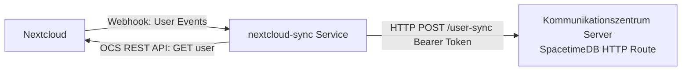

# Nextcloud User Synchronization Service (`nextcloud-sync`)

The `nextcloud-sync` service synchronizes user accounts one-way from Nextcloud to Kommunikationszentrum.

It enables administrators to pre-provision users and subscribe them to mailing list topics **before** they have logged in for the first time. When the user later logs in via OIDC, Kommunikationszentrum links the account using the matching `external_id == sub` (the Nextcloud username / UID).

---

## Architecture Overview



1. **Push (Webhooks):** Nextcloud sends real-time webhook events (user created, changed, deleted).
2. **Pull (OCS REST API):** The service fetches user details (display name, email, enabled status) from Nextcloud's OCS Provisioning API (`/ocs/v2.php/cloud/users/{uid}`).
3. **Upsert / Delete:** The service posts the normalized user data to the SpacetimeDB `user-sync` HTTP route using a webhook bearer token with `sync-user` permission.
4. **Reconciler / Initial Backfill:** Upon startup and periodically (e.g. every 6 hours), the service pages through all Nextcloud users to ensure complete synchronization and heal any missed webhook events.

---

## Environment Variables

| Variable | Required | Default | Description |
|---|---|---|---|
| `NC_URL` | ✓ | — | Base URL of Nextcloud (e.g. `https://cloud.example.org`). |
| `NC_USER` | ✓ | — | Nextcloud administrative user for OCS Provisioning API. |
| `NC_APP_PASSWORD` | ✓ | — | Nextcloud App Password generated for `NC_USER`. |
| `NC_WEBHOOK_SECRET` | ✓ | — | Shared secret token to validate incoming webhook requests. |
| `NC_SYNC_LISTEN_ADDR` | — | `0.0.0.0:8088` | Address and port for the incoming webhook HTTP listener. |
| `NC_RECONCILE_INTERVAL_SECS` | — | `21600` | Full reconciliation interval in seconds (default: 6 hours). |
| `SPACETIME_SYNC_URL` | ✓ | — | URL to Kommunikationszentrum `user-sync` route (e.g. `http://localhost:3000/v1/database/kommunikation/route/user-sync`). |
| `SPACETIME_WEBHOOK_TOKEN` | ✓ | — | Plaintext bearer token authorized for `sync-user`. |

---

## Nextcloud Setup

### 1. Dedicated Nextcloud User (Optional)
It is recommended to run the integration using a dedicated technical user (e.g. `sync-bot`) with administrative read access rather than a personal admin account:

```bash
# Create dedicated user via Nextcloud CLI
occ user:add --display-name="Kommunikationszentrum Sync" --group="admin" sync-bot
```

Alternatively, create the user in the Nextcloud Web UI (**Administration Settings** → **Users**) and ensure they have group permissions to access user provisioning APIs.

### 2. App Password
1. Log in to Nextcloud as the sync user (e.g. `sync-bot` or an admin user).
2. Navigate to **Personal Settings** → **Security** → **Devices & sessions**.
3. Create a new app password named e.g. `kommunikationszentrum-sync`.
4. Set `NC_USER=sync-bot` and `NC_APP_PASSWORD=<generated-app-password>`.

### 3. Generate Webhook Secret
Generate a cryptographically secure 32-byte secret token for authenticating webhook callbacks:

```bash
NC_WEBHOOK_SECRET=$(openssl rand -hex 32)
echo "Generated webhook secret: $NC_WEBHOOK_SECRET"
```

Save this value: it must be used identically when registering the webhook listeners below and in `/etc/kommunikationszentrum/nextcloud-sync.env`.

### 4. Nextcloud Webhook Listeners
Nextcloud (version 30+) provides the `webhook_listeners` app to send webhooks on core events:

```bash
# Register webhook listener for user created
occ webhook_listeners:register \
  --event="OCP\User\Events\UserCreatedEvent" \
  --url="https://sync.example.org/nextcloud/webhook" \
  --header="X-Nextcloud-Token: $NC_WEBHOOK_SECRET"

# Register webhook listener for user updated
occ webhook_listeners:register \
  --event="OCP\User\Events\UserChangedEvent" \
  --url="https://sync.example.org/nextcloud/webhook" \
  --header="X-Nextcloud-Token: $NC_WEBHOOK_SECRET"

# Register webhook listener for user deleted
occ webhook_listeners:register \
  --event="OCP\User\Events\UserDeletedEvent" \
  --url="https://sync.example.org/nextcloud/webhook" \
  --header="X-Nextcloud-Token: $NC_WEBHOOK_SECRET"
```

---

## Production Deployment & Systemd Service

### 1. Build and Install Binary

Compile the release binary and install it to `/usr/local/bin`:

```bash
cargo build --release -p nextcloud-sync
sudo install -m 755 target/release/nextcloud-sync /usr/local/bin/nextcloud-sync
```

### 2. System User & Configuration Directory

Create the dedicated system user and group (if not already created for the `sender` daemon):

```bash
sudo useradd --system --no-create-home --shell /usr/sbin/nologin --user-group kommunikationszentrum 2>/dev/null || true
```

Create the configuration directory and set restrictive directory permissions:

```bash
sudo mkdir -p /etc/kommunikationszentrum
sudo chmod 750 /etc/kommunikationszentrum
sudo chown root:kommunikationszentrum /etc/kommunikationszentrum
```

### 3. Environment Configuration

Generate a SpacetimeDB webhook bearer token with the `sync-user` permission if not already created (see [User Synchronisation](../spacetimedb/http-handlers/user-sync.md#authentication) and [Managing Webhook Tokens](../spacetimedb/module-publishing.md#managing-webhook-tokens)):

```bash
# 1. Generate random token
SPACETIME_WEBHOOK_TOKEN=$(openssl rand -hex 32)

# 2. Hash it with BLAKE3
TOKEN_HASH=$(echo -n "$SPACETIME_WEBHOOK_TOKEN" | b3sum --no-names)

# 3. Register the hash in SpacetimeDB
spacetime call kommunikation create_webhook_token \
  "$TOKEN_HASH" \
  "Nextcloud Sync Service" \
  '["sync-user"]'
```

Create `/etc/kommunikationszentrum/nextcloud-sync.env` (permissions `0600`):

```ini
# Nextcloud Connection
NC_URL=https://cloud.example.org
NC_USER=sync-bot
NC_APP_PASSWORD=<app-password-from-step-2>
NC_WEBHOOK_SECRET=<secret-from-step-3>

# Service Listener & Reconciler
NC_SYNC_LISTEN_ADDR=127.0.0.1:8088
NC_RECONCILE_INTERVAL_SECS=21600

# SpacetimeDB Target
SPACETIME_SYNC_URL=http://localhost:3000/v1/database/kommunikation/route/user-sync
SPACETIME_WEBHOOK_TOKEN=<spacetimedb-token-from-above>
```

Restrict permissions to the service user:
```bash
sudo chown kommunikationszentrum:kommunikationszentrum /etc/kommunikationszentrum/nextcloud-sync.env
sudo chmod 600 /etc/kommunikationszentrum/nextcloud-sync.env
```

### 4. Systemd Unit File

Create `/etc/systemd/system/kommunikationszentrum-nextcloud-sync.service`:

```ini
[Unit]
Description=Kommunikationszentrum Nextcloud User Sync Service
After=network.target

[Service]
Type=simple
User=kommunikationszentrum
Group=kommunikationszentrum
EnvironmentFile=/etc/kommunikationszentrum/nextcloud-sync.env
ExecStart=/usr/local/bin/nextcloud-sync
Restart=on-failure
RestartSec=5s

# Security Hardening
NoNewPrivileges=true
ProtectSystem=full
ProtectHome=true
PrivateTmp=true

[Install]
WantedBy=multi-user.target
```

### 5. Enable and Start the Service

```bash
sudo systemctl daemon-reload
sudo systemctl enable --now kommunikationszentrum-nextcloud-sync.service

# Verify service status and logs
systemctl status kommunikationszentrum-nextcloud-sync.service
journalctl -u kommunikationszentrum-nextcloud-sync.service -f
```

### 6. Reverse Proxy Configuration (HTTPS)

Nextcloud webhook listeners require an HTTPS endpoint. Run a reverse proxy (e.g., Caddy or Nginx) terminating TLS and proxying requests to `NC_SYNC_LISTEN_ADDR` (`127.0.0.1:8088`).

Example Caddy snippet:
```caddy
sync.example.org {
    reverse_proxy 127.0.0.1:8088
}
```

Example Nginx snippet:
```nginx
server {
    listen 443 ssl http2;
    server_name sync.example.org;

    ssl_certificate /path/to/fullchain.pem;
    ssl_certificate_key /path/to/privkey.pem;

    location / {
        proxy_pass http://127.0.0.1:8088;
        proxy_set_header Host $host;
        proxy_set_header X-Real-IP $remote_addr;
        proxy_set_header X-Forwarded-For $proxy_add_x_forwarded_for;
        proxy_set_header X-Forwarded-Proto $scheme;
    }
}
```
