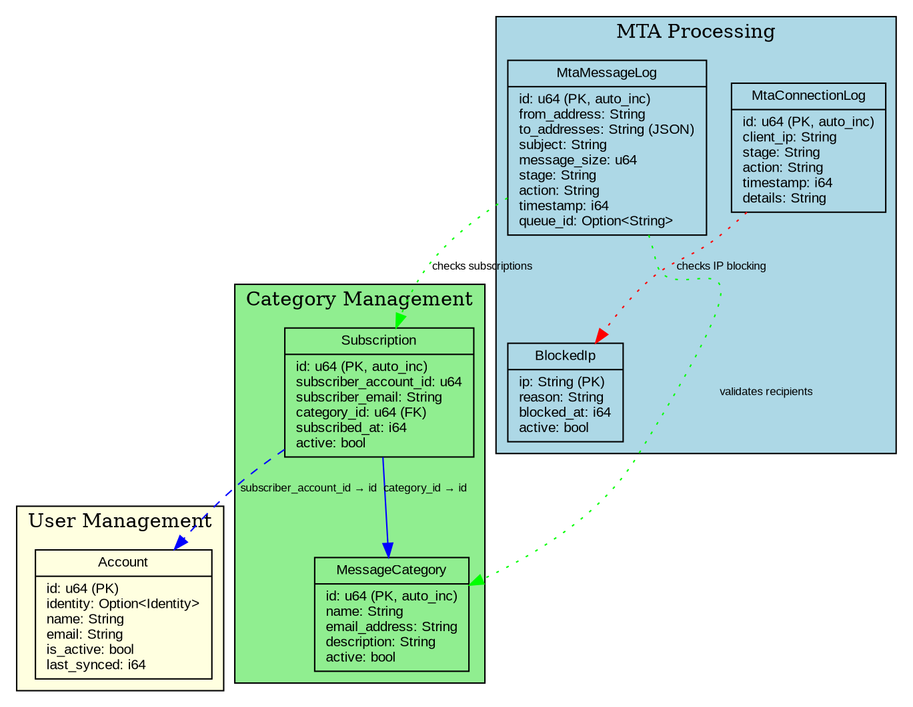
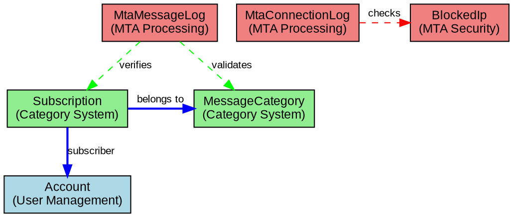

# Database Schema

The SpacetimeDB database schema for the Kommunikationszentrum consists of several interconnected tables that handle user management, email processing, and system logging.

## Schema Overview

The database is organized into three functional groups:

- **User Management**: `account`, `subscriptions`
- **Email Categories**: `message_categories`
- **MTA Processing**: `mta_connection_log`, `mta_message_log`, `blocked_ips`

## Visual Schema



## Entity Relationships



- `subscriptions` → `message_categories` (foreign key relationship)
- `account` table stores user data synchronized from Django
- MTA logs are independent audit tables

## Table Groups

### User Management Tables

**`account`**
- Stores user accounts synchronized from Django
- Links SpacetimeDB identity with user data
- Used for authentication and authorization

**`subscriptions`** 
- Links users to email categories they want to receive
- References `message_categories` via foreign key
- Supports active/inactive subscription states

### Email Category Management

**`message_categories`**
- Defines available email categories (mailing lists)
- Each category has an associated email address
- Used for routing decisions in MTA processing

### MTA Processing Tables

**`mta_connection_log`**
- Logs connection-level MTA events (CONNECT, EHLO, MAIL, RCPT, AUTH)
- Tracks IP addresses, stages, and actions
- Used for connection analysis and spam detection

**`mta_message_log`**
- Logs message-level MTA events (DATA stage)
- Stores message metadata (from, to, subject, size)
- Links to queue IDs for email tracking

**`blocked_ips`**
- IP blacklist for spam protection
- Supports active/inactive states
- Includes reason for blocking and timestamp

## Data Types

The schema uses standard SpacetimeDB data types:

- **Numeric**: `u64` for IDs, `i64` for timestamps
- **Text**: `String` for email addresses, names, and descriptions  
- **Boolean**: `bool` for active/inactive flags
- **JSON**: `String` fields storing JSON data (e.g., `to_addresses` array)
- **Optional**: `Option<T>` for nullable fields

## Primary Keys and Auto-Increment

- Most tables use `u64` auto-increment primary keys (`#[auto_inc]`)
- Exception: `blocked_ips` uses IP address as natural primary key
- Auto-increment ensures unique IDs across database lifecycle

## Foreign Key Relationships

The schema has one explicit foreign key relationship:

```rust
// subscriptions table references message_categories
category_id: u64  // → message_categories.id
```

Other relationships are maintained through application logic rather than database constraints.

## Privacy Considerations

The schema is designed with privacy in mind:

- IP addresses in logs can be redacted as "[REDACTED]"
- Email content is not stored, only metadata
- Personal data is minimized to essential fields only

For detailed field definitions, see [Tables Reference](./tables-reference.md).
