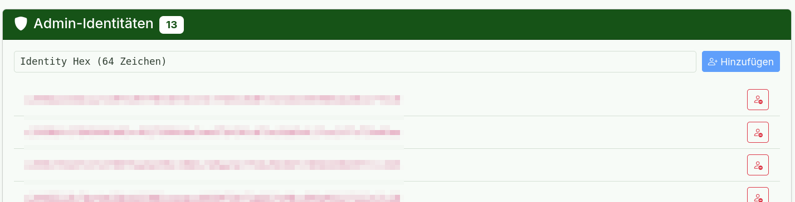

# Module Publishing

How to build, publish, and manage the SpacetimeDB module.

## Prerequisites

- SpacetimeDB CLI installed
- Rust toolchain with `wasm32-unknown-unknown` target
- SpacetimeDB running on port 3000
- Environment variables set:
  - `STALWART_ADMIN_TOKEN` (see [Stalwart Admin API Key Setup](../../email/stalwart-setup.md#admin-api-key-configuration-stalwart_admin_token))
  - `STALWART_JMAP_URL` (typically `http://localhost:8093`; see [Listeners Configuration](../../email/stalwart-setup.md#listeners-configuration-port-8093))

Build and publish require these env vars, so they cannot be run by AI agents.

## Build and Publish

```bash
spacetime build -p server kommunikation
spacetime publish -p server kommunikation
```

Use `-c` with publish to clear the database when the schema changes (deletes all data):

```bash
spacetime publish -p server kommunikation -c
```

## Client Bindings

Regenerate bindings after schema or reducer changes:

```bash
spacetimedb-cli generate --lang dioxus -p server -o admin/src/module_bindings/
spacetimedb-cli generate --lang rust -p server -o sender/src/module_bindings/
```

This uses a custom `spacetimedb-cli` and cannot be run by AI agents.

## SpacetimeDB Server

```bash
spacetime start   # localhost:3000
```

## Status and Debugging

```bash
spacetime describe kommunikation
spacetime list
spacetime logs kommunikation
spacetime logs kommunikation --follow
```

```bash
spacetime sql kommunikation "SELECT COUNT(*) FROM account"
spacetime sql kommunikation "SELECT * FROM message_categories LIMIT 10"
spacetime sql kommunikation "SELECT * FROM mta_connection_log ORDER BY timestamp DESC LIMIT 5"
```

## Development Workflow

1. Edit schema or reducers in `server/`
2. Build: `spacetime build -p server kommunikation`
3. Publish: `spacetime publish -p server kommunikation` (add `-c` for schema resets)
4. Regenerate client bindings (see above)
5. Debug with `spacetime logs kommunikation`

# Initializing the module with initial admin credentials

## Managing Webhook Tokens

External systems authenticate with the module's HTTP endpoints using webhook tokens. Tokens
are created by an admin via the SpacetimeDB CLI or the Admin UI.

### Create a Token

The **plaintext** token must be hashed client-side before calling the reducer. The module never receives or stores the plaintext — only the BLAKE3 hash is registered.

#### Option 1: Via Admin Web UI (Recommended)

The Admin UI allows generating and managing webhook tokens directly in the browser:


1. Open the Admin UI and navigate to the **Webhook Tokens** view.
2. Enter a **Label** (e.g. `Stalwart` for MTA hooks, or `Sync User Token` for Django).
3. Enter or select the required **Permission** (`mta-hook` or `sync-user`).
4. Click **+ Token generieren** to generate a cryptographically random 32-byte token in the browser.
5. Click **Kopieren** to copy the plaintext token and save it securely.
6. Click **Token erstellen**. The browser computes the BLAKE3 hash client-side and registers only the hash with the module via `create_webhook_token`.
7. Existing tokens and permissions are displayed in the list below with a delete button to revoke them.

> [!NOTE]
> The plaintext token is displayed only once in the browser upon generation. It cannot be recovered from the database.

---

#### Option 2: Via SpacetimeDB CLI

Alternatively, generate and hash the token manually using CLI tools:

**For Stalwart MTA hook (`mta-hook` permission):**

```bash
# 1. Generate a random token
TOKEN=$(openssl rand -hex 32)
echo "Save this token securely: $TOKEN"

# 2. Hash it with BLAKE3 (requires b3sum or the spacetime CLI)
TOKEN_HASH=$(echo -n "$TOKEN" | b3sum --no-names)

# 3. Register the hash with the module
spacetime call kommunikation create_webhook_token \
  "$TOKEN_HASH" \
  "Stalwart MTA hook" \
  '["mta-hook"]'
```

**For Django user sync (`sync-user` permission):**

```bash
# 1. Generate a random token
TOKEN=$(openssl rand -hex 32)
echo "Save this token securely: $TOKEN"

# 2. Hash it with BLAKE3
TOKEN_HASH=$(echo -n "$TOKEN" | b3sum --no-names)

# 3. Register the hash with the module
spacetime call kommunikation create_webhook_token \
  "$TOKEN_HASH" \
  "Sync User Token" \
  '["sync-user"]'
```

### Revoke a Token

```bash
spacetime call kommunikation revoke_webhook_token "$TOKEN_HASH"
```

### Available Permissions

| Permission | Endpoint |
|---|---|
| `mta-hook` | `POST /mta-hook` |
| `sync-user` | `POST /user-sync` |

---

## Managing Admin Identities

Admin identities have elevated privileges to execute admin-only reducers and procedures (such as managing webhook tokens, domain sync, category creation, and recipient management).

### Option 1: Via Admin Web UI (Recommended)

Manage identities visually from the **Admin-Identitäten** card:



1. Navigate to the **Admin-Identitäten** view.
2. In the **Identity Hex (64 Zeichen)** input field, paste the 64-character hexadecimal SpacetimeDB identity of the user or service.
3. Click **+ Hinzufügen** to register the identity as an admin.
4. Existing admin identities are listed with their active count. To revoke admin privileges from an identity, click the remove icon next to it.

---

### Option 2: Via SpacetimeDB CLI

**Grant Admin Status:**

```bash
# Get the target user's SpacetimeDB identity hex (64 hex characters)
spacetime call kommunikation register_admin_identity "<64-char-hex>"
```

**Revoke Admin Status:**

```bash
spacetime call kommunikation unregister_admin_identity "<64-char-hex>"
```
