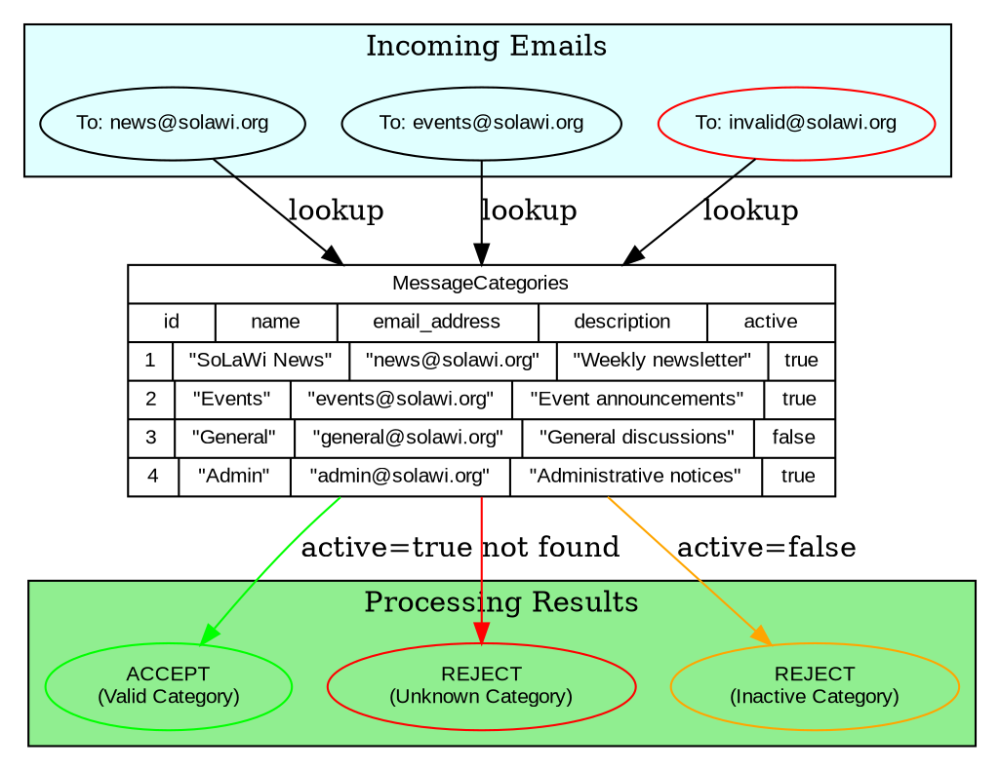
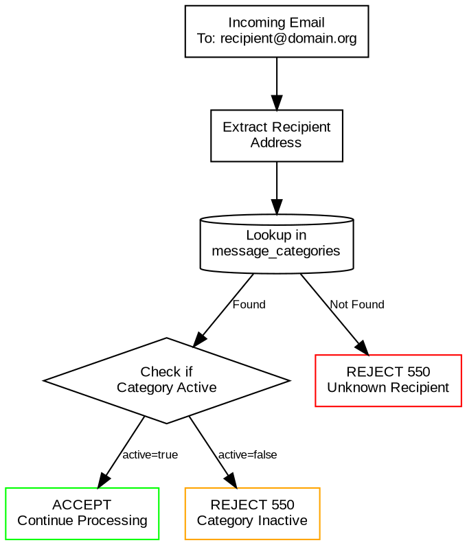
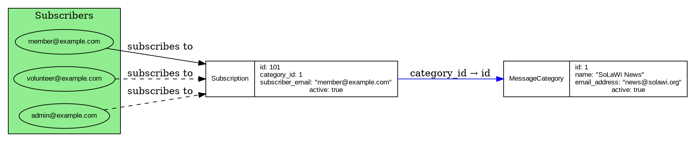

# Email Categories

Email categories form the backbone of the Kommunikationszentrum's email routing system. They define which email addresses are valid recipients and how emails should be processed based on their destination.

## Overview

The email category system enables:

- **Organized Email Lists**: Different topics (news, events, general) as separate categories
- **Targeted Distribution**: Users can subscribe to specific categories of interest  
- **Access Control**: Only valid categories accept incoming emails
- **Administrative Flexibility**: Categories can be activated/deactivated as needed

## Category Structure

### Database Schema

Email categories are stored in the `message_categories` table:

```rust
#[spacetimedb::table(name = message_categories)]
pub struct MessageCategory {
    #[primary_key]
    #[auto_inc]
    pub id: u64,                // Auto-increment primary key
    pub name: String,           // Human-readable category name  
    pub email_address: String,  // Email address for this category
    pub description: String,    // Description of the category
    pub active: bool,           // Whether category is currently active
}
```

### Visual Representation



## Category Management

### Creating Categories

Categories can be created through the admin interface or via SpacetimeDB reducers:

```bash
# Using spacetime CLI
spacetime call kommunikation add_message_category \
  "SoLaWi News" \
  "news@solawi.org" \
  "Weekly newsletter with updates and announcements"
```

**Parameters:**
- `name`: Human-readable category name (e.g., "SoLaWi News")
- `email_address`: Unique email address for the category
- `description`: Detailed description of the category's purpose

**Authorization**: Only admin users can create categories.

### Category Examples

Typical categories for a SoLaWi (community-supported agriculture) project:

| Name | Email Address | Description | Active |
|------|---------------|-------------|---------|
| SoLaWi News | `news@solawi.org` | Weekly newsletter with updates | ✅ |
| Events | `events@solawi.org` | Event announcements and invitations | ✅ |
| General Discussion | `general@solawi.org` | General community discussions | ✅ |
| Harvest Updates | `harvest@solawi.org` | Weekly harvest distribution info | ✅ |
| Admin Notices | `admin@solawi.org` | Administrative announcements | ✅ |
| Board Meetings | `board@solawi.org` | Board meeting minutes and notices | ❌ |

### Deactivating Categories

Categories can be temporarily or permanently deactivated:

```bash
# Deactivate a category (SQL-like syntax)
spacetime sql "UPDATE message_categories SET active = false WHERE id = 3"
```

**Effects of deactivation:**
- New emails to the category are rejected
- Existing subscriptions remain but are inactive
- Category still appears in admin interface
- Can be reactivated later

## Email Address Validation

### Format Requirements

Category email addresses must follow these rules:

1. **Valid email format**: `name@domain.tld`
2. **Unique addresses**: No two categories can share the same email
3. **Domain consistency**: Typically use the same domain (e.g., `@solawi.org`)
4. **Descriptive names**: Use meaningful prefixes (`news@`, `events@`, etc.)

### Domain Configuration

For proper email routing, ensure:

1. **DNS MX records** point to your Stalwart MTA server
2. **Virtual domain** configuration includes category domains
3. **Wildcard routing** or explicit address mapping in MTA

### Address Patterns

Common patterns for category addresses:

```
# Topic-based categories
news@solawi.org          # Newsletter content
events@solawi.org        # Event announcements  
general@solawi.org       # General discussions
harvest@solawi.org       # Harvest information

# Functional categories
admin@solawi.org         # Administrative notices
board@solawi.org         # Board communications
members@solawi.org       # Member-only content

# Geographic or group-based
north-region@solawi.org  # Regional information
volunteers@solawi.org    # Volunteer coordination
```

## Category Processing Logic

### Validation Flow



### Implementation Details

The category validation happens in the `handle_rcpt` function:

```rust
// Pseudocode for RCPT TO stage processing
async fn handle_rcpt(request: &MtaHookRequest) -> Result<MtaHookResponse> {
    for recipient in &request.envelope.to {
        let to_address = &recipient.address;
        
        // Lookup category by email address
        let category = query_category_by_email(to_address).await?;
        
        match category {
            Some(cat) if cat.active => {
                // Category found and active - continue processing
                continue;
            }
            Some(_) => {
                // Category found but inactive
                return Ok(MtaHookResponse::reject(550, "Category inactive"));
            }
            None => {
                // Category not found
                return Ok(MtaHookResponse::reject(550, "Unknown recipient"));  
            }
        }
    }
    
    // All recipients valid
    Ok(MtaHookResponse::accept())
}
```

## Integration with Subscriptions

Categories work closely with the subscription system:

### Subscription Relationship



### Subscription Validation

In the DATA stage, the system validates that senders are subscribed to the target categories:

```rust
// Pseudocode for subscription validation
async fn validate_subscriptions(from_email: &str, to_emails: &[String]) -> ValidationResult {
    for to_email in to_emails {
        let category = lookup_category_by_email(to_email).await?;
        let subscription = lookup_subscription(from_email, category.id).await?;
        
        match subscription {
            Some(sub) if sub.active => {
                // Sender is subscribed - allow
                continue;
            }
            _ => {
                // Not subscribed - quarantine for review
                return ValidationResult::Quarantine("Sender not subscribed");
            }
        }
    }
    
    ValidationResult::Accept
}
```

## Administrative Features

### Category Statistics

Track category usage and health:

```sql
-- Categories by subscription count
SELECT 
    mc.name,
    mc.email_address,
    COUNT(s.id) as subscriber_count,
    mc.active
FROM message_categories mc
LEFT JOIN subscriptions s ON mc.id = s.category_id AND s.active = true
GROUP BY mc.id
ORDER BY subscriber_count DESC;
```

### Category Activity

Monitor email traffic per category:

```sql
-- Email activity by category (last 30 days)
SELECT 
    mc.name,
    COUNT(mml.id) as email_count,
    COUNT(CASE WHEN mml.action = 'ACCEPT' THEN 1 END) as accepted,
    COUNT(CASE WHEN mml.action = 'REJECT' THEN 1 END) as rejected,
    COUNT(CASE WHEN mml.action = 'QUARANTINE' THEN 1 END) as quarantined
FROM message_categories mc
LEFT JOIN mta_message_log mml ON JSON_EXTRACT(mml.to_addresses, '$[0]') = mc.email_address
WHERE mml.timestamp > (UNIX_TIMESTAMP() - 30*24*3600)
GROUP BY mc.id;
```

### Bulk Operations

```bash
# Activate multiple categories
spacetime call kommunikation batch_update_categories \
  '[{"id": 1, "active": true}, {"id": 2, "active": true}]'

# Import categories from CSV
cat categories.csv | while IFS=',' read name email description; do
  spacetime call kommunikation add_message_category "$name" "$email" "$description"
done
```

## Best Practices

### Naming Conventions

1. **Descriptive names**: Use clear, meaningful category names
2. **Consistent formatting**: Follow a standard naming pattern
3. **Language considerations**: Use appropriate language for your community
4. **Avoid conflicts**: Don't use generic terms that might cause confusion

### Email Address Design

1. **Predictable patterns**: Use consistent prefixes/suffixes
2. **Avoid special characters**: Stick to alphanumeric and hyphens
3. **Consider aliases**: Set up email aliases for common variations
4. **Document addresses**: Maintain a registry of all category addresses

### Category Lifecycle

1. **Planning**: Plan categories before creating subscriptions
2. **Testing**: Test categories with small groups first
3. **Migration**: Provide migration paths when changing categories
4. **Archival**: Archive rather than delete historical categories

### Security Considerations

1. **Access control**: Limit category creation to admins
2. **Audit trail**: Log all category changes
3. **Regular review**: Periodically review active categories
4. **Cleanup**: Remove unused categories to reduce attack surface

## Troubleshooting

### Common Issues

**Category not receiving emails**
- Check if category is active
- Verify DNS MX records
- Check MTA routing configuration
- Review MTA connection logs

**Emails rejected for valid categories** 
- Verify email address spelling
- Check category activation status
- Review MTA hook processing logs
- Validate SpacetimeDB connectivity

**Subscription issues**
- Check foreign key relationships
- Verify subscription active status  
- Review subscription creation logs
- Check user permissions

### Debugging Commands

```bash
# List all categories
spacetime sql "SELECT * FROM message_categories"

# Check category activity status  
spacetime sql "SELECT name, email_address, active FROM message_categories WHERE active = false"

# Find categories without subscriptions
spacetime sql "
SELECT mc.name, mc.email_address 
FROM message_categories mc
LEFT JOIN subscriptions s ON mc.id = s.category_id
WHERE s.id IS NULL"

# Recent category processing
spacetime sql "SELECT * FROM mta_connection_log WHERE stage = 'RCPT' ORDER BY timestamp DESC LIMIT 10"
```

## Next Steps

After setting up email categories:

1. Configure user [Subscription System](./subscriptions.md)
2. Review the complete [Processing Flow](./processing-flow.md)
3. Set up [MTA Hook Configuration](./mta-hook-config.md) for proper routing
4. Return to [Stalwart MTA Setup](./stalwart-setup.md) for server integration
