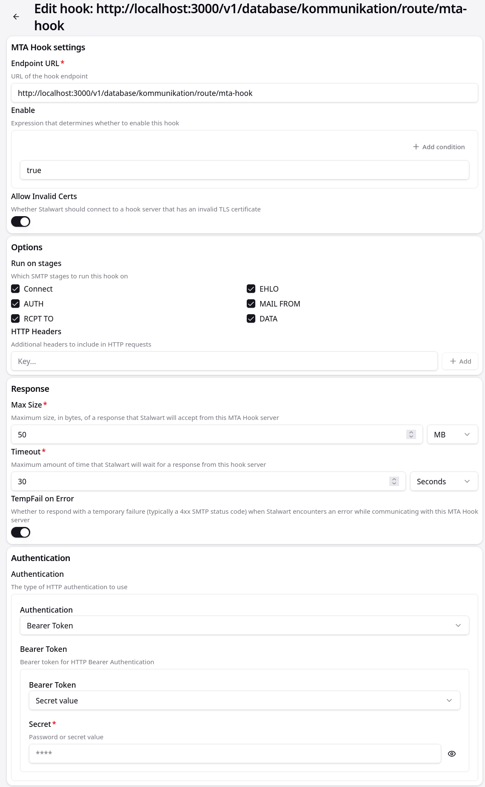

# MTA Hook Configuration

This page documents how the Kommunikationszentrum SpacetimeDB module accepts and processes MTA hooks from Stalwart. The module exposes an HTTP handler that implements per-stage processing and persists message deliveries to the database.

## Hook Protocol

The module implements the standard Stalwart MTA hook protocol. External systems POST a JSON payload for each SMTP stage to the module route. The request format follows the `stalwart_mta_hook_types::Request` type.

### Hook Request Format

A typical hook request contains `context` (stage, client/server metadata), optional `envelope`, and optional `message` fields. See the API Endpoints page for exact examples and test payloads.

### Hook Response Format

Handlers return a `stalwart_mta_hook_types::Response` JSON object with fields similar to:

```json
{
  "action": "accept|reject|quarantine",
  "code": 250,
  "reason": "Message accepted",
  "modifications": [ /* optional server-side headers to add */ ]
}
```

## Deployment and Configuration

In Stalwart MTA, configure the hook to POST to the SpacetimeDB module HTTP route:

```
POST http://localhost:3000/v1/database/kommunikation/route/mta-hook
```

For complete step-by-step setup in Stalwart, see [Stalwart MTA Setup — MTA Hook Configuration](./stalwart-setup.md#mta-hook-configuration).



- **Authentication**: External callers must provide `Authorization: Bearer <token>` carrying the `mta-hook` permission.
- **Token Generation**: For step-by-step instructions on generating, BLAKE3 hashing, and registering a webhook token, see [Managing Webhook Tokens / Token Generation](../core/spacetimedb/module-publishing.md#managing-webhook-tokens).

---

## Stage-Specific Handling

The SpacetimeDB handler executes validation and persistence logic for each SMTP stage inside atomic `ctx.with_tx(...)` transactions:

| Stage | Purpose | Detailed Documentation |
|---|---|---|
| `CONNECT` | IP blocklist check against `blocked_ips` table | [Processing Flow — CONNECT](./processing-flow.md#1-connect-stage) |
| `EHLO` | HELO/EHLO argument syntax validation | [Processing Flow — EHLO](./processing-flow.md#2-ehlohelo-stage) |
| `MAIL FROM` | Sender address syntax validation | [Processing Flow — MAIL FROM](./processing-flow.md#3-mail-from-stage) |
| `RCPT TO` | Category recipient check against `message_categories.email_address` | [Processing Flow — RCPT TO](./processing-flow.md#4-rcpt-to-stage) |
| `DATA` | Content extraction, subscriber verification, `received_message` & `mail_ingress` persistence | [Processing Flow — DATA](./processing-flow.md#5-data-stage) |
| `AUTH` | Connection audit logging (pass-through) | [Processing Flow — AUTH](./processing-flow.md#6-auth-stage) |

For SpacetimeDB internal implementation details, table schemas, and reducer/transaction behavior, see [MTA Hook Processing (SpacetimeDB API)](../core/spacetimedb/http-handlers/mta-hook-processing.md).
