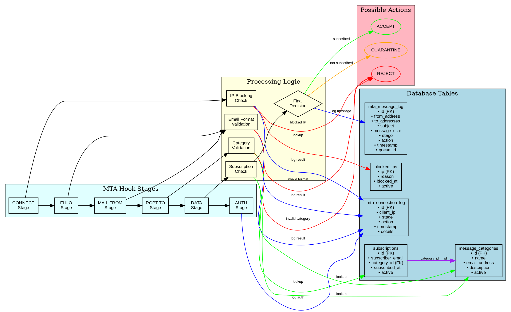

# Processing Flow

The email processing flow in the Kommunikationszentrum follows a multi-stage validation process based on MTA hooks from Stalwart.

## MTA Processing Pipeline



## Processing Stages

### 1. CONNECT Stage
- **Purpose**: Initial connection validation
- **Checks**: IP blocking via `blocked_ips` table
- **Logging**: `mta_connection_log`
- **Actions**: ACCEPT or REJECT based on IP status

### 2. EHLO/HELO Stage  
- **Purpose**: Protocol compliance validation
- **Checks**: Basic HELO/EHLO syntax
- **Logging**: `mta_connection_log`
- **Actions**: ACCEPT for valid, REJECT for invalid

### 3. MAIL FROM Stage
- **Purpose**: Sender validation
- **Checks**: Email address format validation
- **Logging**: `mta_connection_log`
- **Actions**: ACCEPT for valid format, REJECT for invalid

### 4. RCPT TO Stage
- **Purpose**: Recipient and category validation
- **Checks**: 
  - Email address format
  - Category exists in `message_categories`
  - Category is active
- **Logging**: `mta_connection_log`
- **Actions**: ACCEPT for valid categories, REJECT for unknown

### 5. DATA Stage
- **Purpose**: Full message processing and subscription validation
- **Checks**:
  - Subscription exists in `subscriptions` table
  - Subscription is active
  - Sender is subscribed to target category
- **Logging**: `mta_message_log` (detailed message information)
- **Actions**: 
  - ACCEPT: Subscriber sending to subscribed category
  - QUARANTINE: Non-subscriber or inactive subscription
  - REJECT: System errors or policy violations

### 6. AUTH Stage
- **Purpose**: Authentication handling
- **Current Implementation**: Accept-all (placeholder)
- **Logging**: `mta_connection_log`
- **Future**: Could integrate with Django authentication

## Decision Logic

### IP Blocking (CONNECT)
```rust
if blocked_ip.active && blocked_ip.ip == client_ip {
    return REJECT;
}
```

### Category Validation (RCPT)
```rust
if !message_categories.contains(recipient_email) || !category.active {
    return REJECT;
}
```

### Subscription Validation (DATA)
```rust
if subscription.active && subscription.category_id == target_category.id 
   && subscription.subscriber_email == sender_email {
    return ACCEPT;
} else {
    return QUARANTINE; // Could be legitimate but unsubscribed
}
```