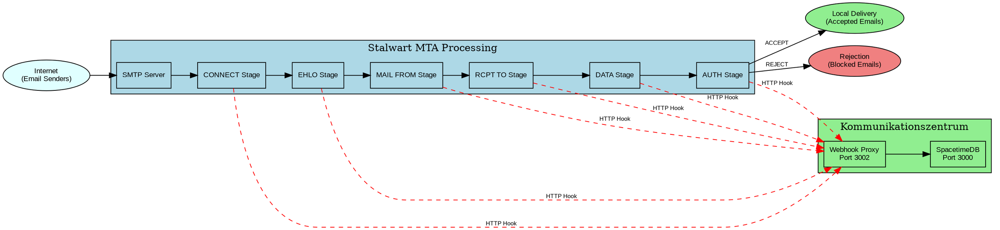

# Stalwart MTA Setup

The Kommunikationszentrum integrates with the Stalwart MTA (Mail Transfer Agent) to process incoming emails through a sophisticated hook-based system. This document covers the setup and configuration requirements.

## Overview

Stalwart MTA is a modern mail server that supports webhook-based processing hooks. The integration enables the Kommunikationszentrum to:

- Validate incoming emails against subscription lists
- Block spam and unwanted content
- Route emails based on categories
- Log all email processing activity

## Architecture



## Prerequisites

Before setting up Stalwart MTA integration, ensure you have:

1. **Stalwart MTA installed** and running
2. **Kommunikationszentrum components** deployed:
   - SpacetimeDB server (port 3000)
   - Webhook proxy (port 3002)
3. **Network connectivity** between Stalwart and webhook proxy
4. **Administrative access** to Stalwart configuration

## Basic Stalwart Configuration

Hook Configuration:

Add the following to your Stalwart MTA configuration file (typically `/etc/stalwart-mail/config.toml`):

```toml
[session.hook]
# URL of the Kommunikationszentrum webhook proxy
url = "http://localhost:3002/mta-hook"

# Timeout for webhook responses
timeout = "30s"

# Retry configuration
retry.max = 3
retry.delay = "1s"
```

Hook Stages:

Configure which stages should trigger hooks:

```toml
[session.hook.stage]
# Connection validation
connect = true

# EHLO/HELO validation  
ehlo = true

# Sender validation
mail = true

# Recipient validation  
rcpt = true

# Message content processing
data = true

# Authentication handling
auth = true
```

Error Handling:

Configure how Stalwart handles webhook errors:

```toml
[session.hook.error]
# Action when webhook is unavailable
# Options: accept, reject, quarantine
on_unavailable = "quarantine"

# Action when webhook times out
on_timeout = "quarantine"

# Action when webhook returns invalid response
on_invalid = "reject"
```

## Testing the Configuration

### 1. Configuration Validation

Test your Stalwart configuration:

```bash
stalwart-mail --config /etc/stalwart-mail/config.toml --dry-run
```

### 2. Hook Connectivity Test

Verify that Stalwart can reach the webhook:

```bash
curl -X POST http://localhost:3002/mta-hook \
  -H "Content-Type: application/json" \
  -d '{
    "context": {
      "stage": "connect",
      "client": {
        "ip": "127.0.0.1",
        "helo": "test.example.com"
      }
    }
  }'
```

Expected response:
```json
{
  "action": "accept"
}
```

# Next Steps

After setting up Stalwart MTA:

1. Configure [MTA Hook Configuration](./mta-hook-config.md) for detailed hook handling
2. Set up [Email Categories](./categories.md) for content routing  
3. Implement [Subscription System](./subscriptions.md) for user management
4. Review [Processing Flow](./processing-flow.md) for understanding the decision logic
