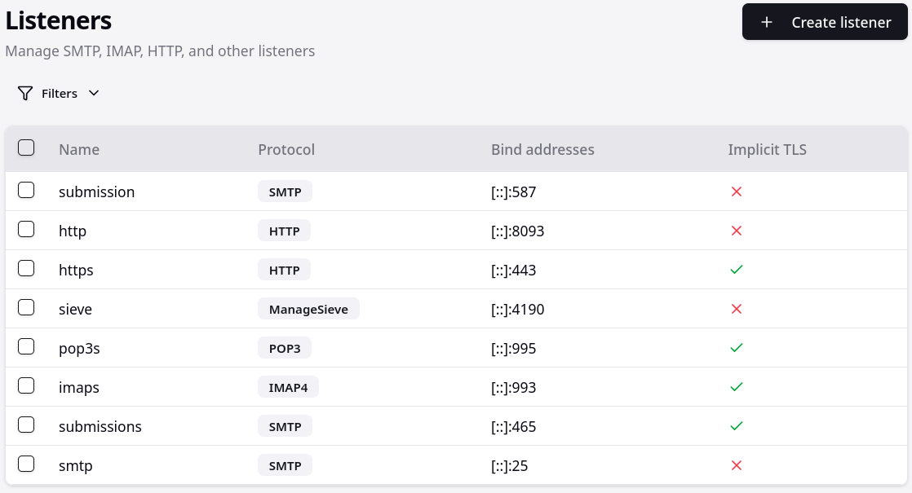
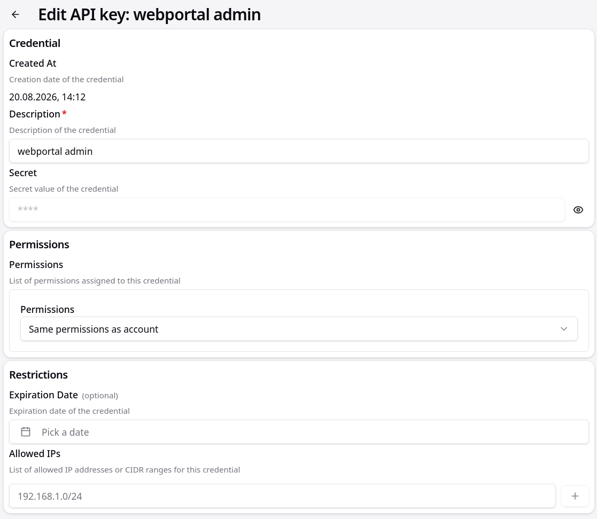
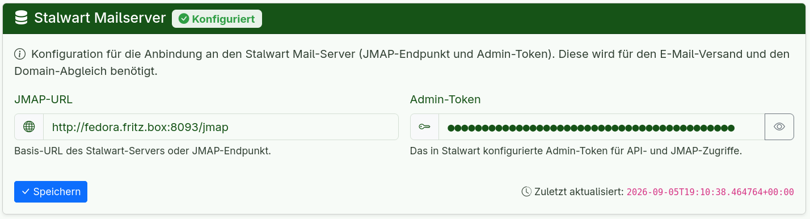
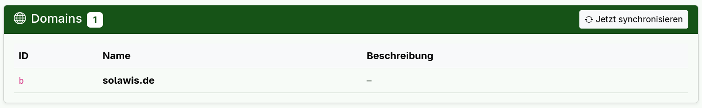
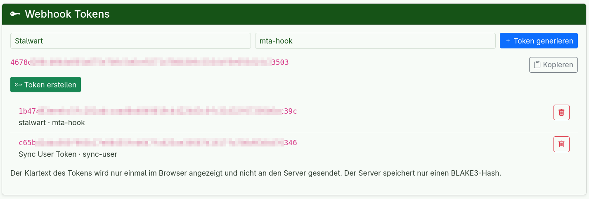
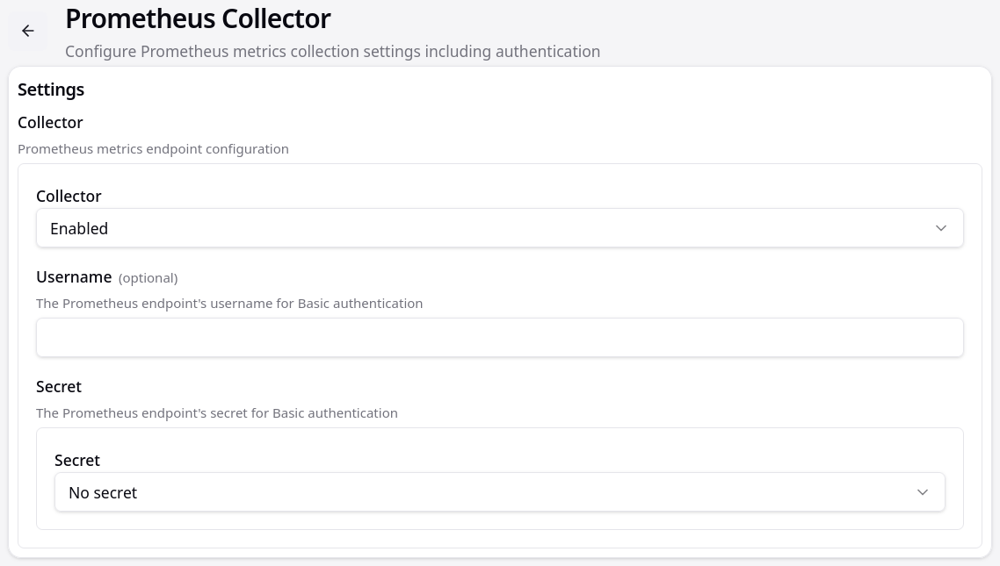
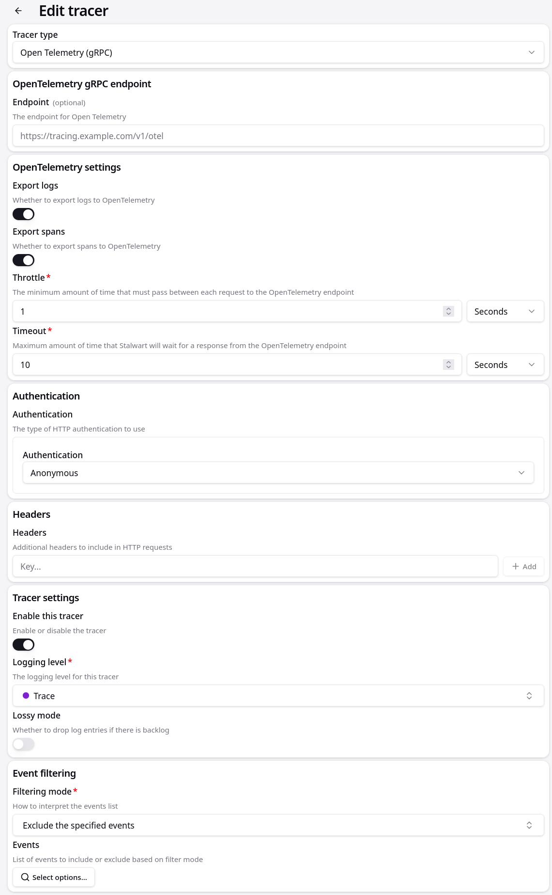

# Stalwart MTA Setup

The Kommunikationszentrum integrates with the Stalwart MTA (Mail Transfer Agent) to handle inbound email via HTTP webhooks, outbound delivery via SMTP submission with per-category app passwords, and domain/mailbox provisioning via the JMAP REST API.

---

## Architecture

```d2
{{#include stalwart-architecture.d2}}
```

---

## Prerequisites & Installation

1. **Install Stalwart MTA**:
   ```bash
   curl --proto '=https' --tlsv1.2 -sSf https://get.stalw.art/install.sh -o install.sh
   sudo sh install.sh
   ```

2. **Retrieve initial administrator credentials**:
   ```bash
   journalctl -u stalwart
   ```
   Look for the generated admin username and initial password in the systemd journal.

3. **Log in to the Web Admin UI**:
   Navigate to the Stalwart management interface (by default on port 8080/443 or your configured listener port).

---

## Listeners Configuration (Port 8093)

By default, Stalwart may listen for HTTP on port 8080. In this environment, the HTTP listener is changed to bind to **port 8093** (`[::]:8093`). This prevents port conflicts with other local services (such as SpacetimeDB on port 3000 and Django on port 8000) and provides a dedicated endpoint for Stalwart's Web Admin UI, JMAP REST API, and Prometheus metrics scraping.



### Standard Port Allocation

| Listener Name | Protocol | Bind Address | Implicit TLS | Description |
|---|---|---|---|---|
| `http` | HTTP | `[::]:8093` | No | Web Admin UI, JMAP REST API, and Prometheus metrics endpoint. |
| `https` | HTTP | `[::]:443` | Yes | Secure web admin and JMAP endpoint. |
| `smtp` | SMTP | `[::]:25` | No | Inbound SMTP mail from external MTAs. |
| `submission` | SMTP | `[::]:587` | No | Mail submission by authorized clients (STARTTLS). |
| `submissions` | SMTP | `[::]:465` | Yes | Implicit TLS submission used by the sender daemon. |
| `imaps` | IMAP4 | `[::]:993` | Yes | Secure IMAP mailbox access. |
| `pop3s` | POP3 | `[::]:995` | Yes | Secure POP3 mailbox access. |
| `sieve` | ManageSieve | `[::]:4190` | No | Sieve script management. |

---

## Admin API Key Configuration (`STALWART_ADMIN_TOKEN`)

The SpacetimeDB module calls Stalwart's JMAP REST API for automated domain synchronization (`sync_stalwart_domains`) and category mailbox provisioning (`provision_message_category`). To allow the module to authenticate with Stalwart, create an Admin API key:

1. In the Stalwart Web Admin UI, navigate to **Management → API Keys** (or **Directory → API Keys**).
2. Click **Create API key**.
3. Configure the credential:
   - **Description**: `webportal admin`
   - **Permissions**: Select `Same permissions as account` (grants administrative rights).
   - **Restrictions**: Optionally restrict to trusted IPs (e.g. `192.168.1.0/24` or localhost).
4. Save the credential and copy the generated **Secret** value.



> [!IMPORTANT]
> The secret value is your `STALWART_ADMIN_TOKEN`. You can configure SpacetimeDB to connect to Stalwart in two ways:

#### Option 1: Via Kommunikationszentrum Admin UI (Recommended)

In the Admin UI, open the **Stalwart Mailserver** card:



1. Set the **JMAP-URL** (e.g. `http://<stalwart-host>:8093/jmap` or `http://localhost:8093/jmap`).
2. Paste the generated **Admin-Token** secret from Stalwart.
3. Click **Speichern** to persist the configuration via the `set_stalwart_config` reducer.

#### Option 2: Via SpacetimeDB CLI or Build Environment

- Set dynamically at runtime via the `set_stalwart_config` reducer:
  ```bash
  spacetime call kommunikation set_stalwart_config "http://localhost:8093/jmap" "<stalwart-api-key-secret>"
  ```
- Or pass `STALWART_ADMIN_TOKEN` and `STALWART_JMAP_URL` as environment variables at compile/publish time (see [Module Publishing](../core/spacetimedb/module-publishing.md)).

---

## Domain Synchronization

Once the Stalwart mailserver connection is saved, SpacetimeDB can synchronize the domain inventory configured in Stalwart:



1. In the Admin UI, navigate to the **Domains** card.
2. Click **Jetzt synchronisieren**.
3. SpacetimeDB calls Stalwart's JMAP API (`sync_stalwart_domains` procedure), fetching all domains (e.g. `solawis.de`) and writing them to the `domains` table.
4. Synchronized domains are then available when creating and provisioning new message categories.

You can also trigger domain synchronization via the CLI:

```bash
spacetime call kommunikation sync_stalwart_domains
```

---

## MTA Hook Configuration

Stalwart uses webhook-based hooks to forward incoming SMTP session events to the SpacetimeDB module HTTP handler at:

```
http://localhost:3000/v1/database/kommunikation/route/mta-hook
```

### Web Admin UI Setup

#### Step 1: Generate the Webhook Token in Kommunikationszentrum Admin UI

Before configuring Stalwart, generate a webhook token with the `mta-hook` permission in the Kommunikationszentrum Admin Web UI:



1. Open the Admin UI and navigate to the **Webhook Tokens** view.
2. Enter label `Stalwart` and permission `mta-hook`.
3. Click **+ Token generieren** to create the token.
4. Click **Kopieren** to copy the plaintext token (needed in Stalwart below).
5. Click **Token erstellen** to register the BLAKE3 hash in SpacetimeDB.

#### Step 2: Configure the Hook in Stalwart Web Admin UI

1. In the Stalwart Web Admin UI, navigate to **Settings → Hooks** (or **MTA Hooks**).
2. Click **Create hook** (or edit the existing hook).
3. Fill in the fields as shown below:


| Section | Setting | Value | Rationale |
|---|---|---|---|
| **MTA Hook settings** | **Endpoint URL** | `http://localhost:3000/v1/database/kommunikation/route/mta-hook` | Target SpacetimeDB HTTP route. |
| | **Enable** | `true` | Expression that activates the hook for all sessions. |
| | **Allow Invalid Certs** | Disabled | Keep disabled unless testing with self-signed TLS certificates. |
| **Options** | **Run on stages** | Connect, EHLO, AUTH, MAIL FROM, RCPT TO, DATA | Enable all 6 stages for full validation and delivery pipeline support. |
| | **HTTP Headers** | _(none)_ | Optional custom headers. |
| **Response** | **Max Size** | `50 MB` | Upper limit for response payloads accepted from SpacetimeDB. |
| | **Timeout** | `30 Seconds` | Maximum time to wait for a stage response before taking error action. |
| | **TempFail on Error** | Enabled | Returns a temporary 4xx failure to the sending MTA on internal error so mail is retried. |
| **Authentication** | **Authentication** | `Bearer Token` | Select Bearer Token authentication. |
| | **Bearer Token** | `Secret value` | Select secret value mode. |
| | **Secret** | `<plaintext-webhook-token>` | Plaintext token created with `mta-hook` permission (see [Managing Webhook Tokens](../core/spacetimedb/module-publishing.md#managing-webhook-tokens)). |

---

## Monitoring & Telemetry

Stalwart provides native Prometheus metrics export and OpenTelemetry distributed tracing.

### Prometheus Metrics Collector

Stalwart exposes a built-in Prometheus metrics endpoint on its HTTP listener port (e.g. `http://<host>:8093/metrics/prometheus`).



1. In the Stalwart Web Admin UI, navigate to **Settings → Telemetry / Metrics → Prometheus Collector**.
2. Set **Collector** to `Enabled`.
3. Set **Username** / **Secret** if you require basic authentication (or `No secret` for internal network scraping).
4. Configure Prometheus (e.g. in `grafana/prometheus.yaml`):

```yaml
scrape_configs:
  - job_name: 'stalwart'
    metrics_path: '/metrics/prometheus'
    metric_relabel_configs:
      - source_labels: [__name__]
        regex: '(.*)'
        replacement: 'stalwart_$1'
        target_label: __name__
        action: replace
    static_configs:
      - targets: ['host.containers.internal:8093']
```

For more details, see [Operations: Monitoring](../operations/monitoring.md).

---

### OpenTelemetry Distributed Tracing

Stalwart can export traces and logs over gRPC to an OpenTelemetry collector:



1. In the Stalwart Web Admin UI, navigate to **Settings → Telemetry / Tracing → Tracer**.
2. Configure:
   - **Tracer type**: `Open Telemetry (gRPC)`
   - **Endpoint**: Nothing if local, or the url of your OpenTelemetry collector (e.g. `http://localhost:4317`).
   - **Export logs**: Enabled
   - **Export spans**: Enabled
   - **Authentication**: `Anonymous` (or Bearer / Basic)
   - **Enable this tracer**: Enabled
   - **Logging level**: `Trace`
