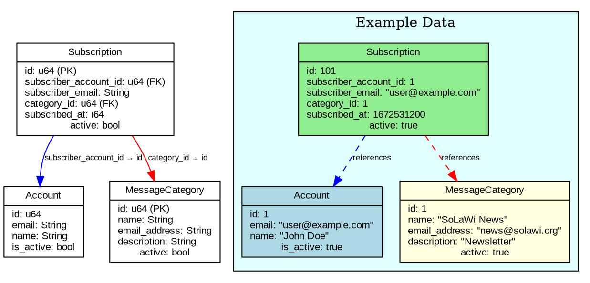
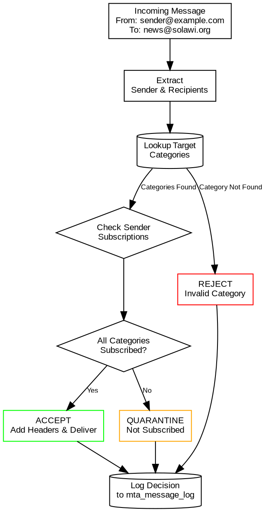

# Subscription System

The subscription system manages which users can send emails to which categories in the Kommunikationszentrum. It provides fine-grained access control and ensures that only authorized senders can distribute content to email lists.

## Overview

The subscription system enables:

- **User-Category Mapping**: Links users to email categories they can send to
- **Access Control**: Prevents unauthorized email distribution
- **Flexible Management**: Users can be subscribed/unsubscribed from categories
- **Audit Trail**: Complete history of subscription changes

## Subscription Model

### Database Schema

Subscriptions are stored in the `subscriptions` table:

```rust
#[spacetimedb::table(name = subscriptions)]
pub struct Subscription {
    #[primary_key]
    #[auto_inc]
    pub id: u64,                    // Auto-increment primary key
    pub subscriber_account_id: u64, // References account.id
    pub subscriber_email: String,   // Email address of subscriber
    pub category_id: u64,           // Foreign key to message_categories.id
    pub subscribed_at: i64,         // Timestamp when subscription was created
    pub active: bool,               // Whether subscription is currently active
}
```

### Relationship Diagram



## Subscription Management

### Creating Subscriptions

Subscriptions can be created through multiple methods:

#### Via SpacetimeDB Reducer

```bash
# Add subscription for user to category
spacetime call kommunikation add_subscription \
  1 \                          # subscriber_account_id
  "user@example.com" \         # subscriber_email
  1                            # category_id
```

#### Via Admin Interface

Users with admin privileges can manage subscriptions through the web interface:

1. Navigate to User Management
2. Select user account
3. Choose categories to subscribe to  
4. Confirm subscription creation

#### Via User Self-Service

Regular users can manage their own subscriptions:

1. Login to personal dashboard
2. View available categories
3. Subscribe/unsubscribe as desired
4. Changes take effect immediately

### Subscription Validation

The system validates subscriptions during creation:

```rust
// Validation logic (pseudocode)
async fn validate_subscription(
    subscriber_account_id: u64,
    subscriber_email: &str, 
    category_id: u64
) -> Result<(), SubscriptionError> {
    
    // Check if account exists and is active
    let account = lookup_account(subscriber_account_id).await?;
    if !account.is_active {
        return Err(SubscriptionError::InactiveAccount);
    }
    
    // Check if category exists and is active
    let category = lookup_category(category_id).await?;
    if !category.active {
        return Err(SubscriptionError::InactiveCategory);
    }
    
    // Check if subscription already exists
    if subscription_exists(subscriber_email, category_id).await? {
        return Err(SubscriptionError::DuplicateSubscription);
    }
    
    // Validate email format
    if !is_valid_email(subscriber_email) {
        return Err(SubscriptionError::InvalidEmail);
    }
    
    Ok(())
}
```

## Email Processing with Subscriptions

### Subscription Checking Flow

During the DATA stage of MTA processing, the system validates that senders are subscribed to target categories:



### Implementation Details

```rust
// Subscription validation in DATA stage (pseudocode)
async fn validate_sender_subscriptions(
    from_email: &str,
    to_emails: &[String]
) -> Result<ValidationResult, ProcessingError> {
    
    let mut unsubscribed_categories = Vec::new();
    
    for to_email in to_emails {
        // Lookup category by email address
        let category = match lookup_category_by_email(to_email).await? {
            Some(cat) => cat,
            None => return Ok(ValidationResult::Reject("Unknown category")),
        };
        
        // Check if sender is subscribed to this category
        let subscription = lookup_subscription(from_email, category.id).await?;
        
        match subscription {
            Some(sub) if sub.active => {
                // Sender is subscribed and subscription is active
                continue;
            }
            Some(_) => {
                // Subscription exists but is inactive
                unsubscribed_categories.push(category.name);
            }
            None => {
                // No subscription found
                unsubscribed_categories.push(category.name);
            }
        }
    }
    
    if unsubscribed_categories.is_empty() {
        Ok(ValidationResult::Accept)
    } else {
        Ok(ValidationResult::Quarantine(format!(
            "Not subscribed to: {}", 
            unsubscribed_categories.join(", ")
        )))
    }
}
```


## Integration with Django

### User Synchronization

Subscriptions are synchronized with the Django `solawispielplatz` system:

```python
# Django management command: sync_subscriptions_to_spacetimedb.py
def sync_user_subscriptions(user_id, categories):
    """Sync user subscriptions to SpacetimeDB"""
    
    # Get current SpacetimeDB subscriptions
    current_subs = get_spacetimedb_subscriptions(user_id)
    
    # Calculate changes needed
    to_add = set(categories) - set(current_subs)
    to_remove = set(current_subs) - set(categories)
    
    # Apply changes via webhook proxy
    for category_id in to_add:
        requests.post(f"{WEBHOOK_URL}/add_subscription", json={
            "subscriber_account_id": user_id,
            "subscriber_email": user.email,
            "category_id": category_id
        })
    
    for category_id in to_remove:
        requests.post(f"{WEBHOOK_URL}/remove_subscription", json={
            "subscriber_account_id": user_id,
            "category_id": category_id  
        })
```

### OAuth Integration

Users authenticate via Django OAuth to manage their subscriptions:

1. User logs in via Django OAuth
2. JWT token contains subscription permissions
3. Admin interface validates JWT before showing subscription options
4. Changes are applied to SpacetimeDB via webhook proxy