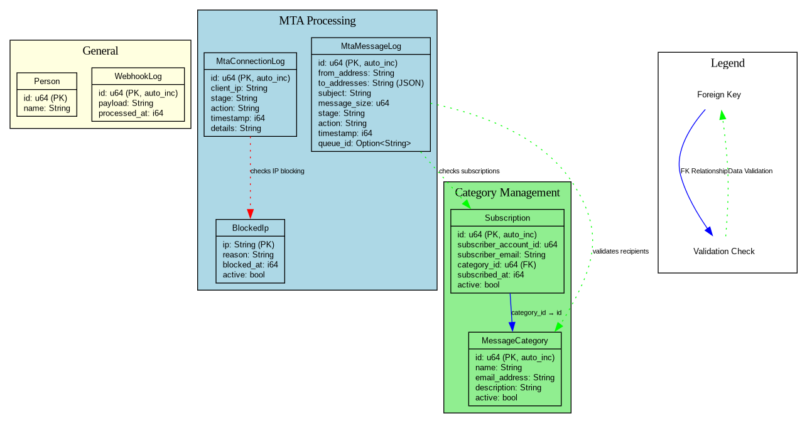
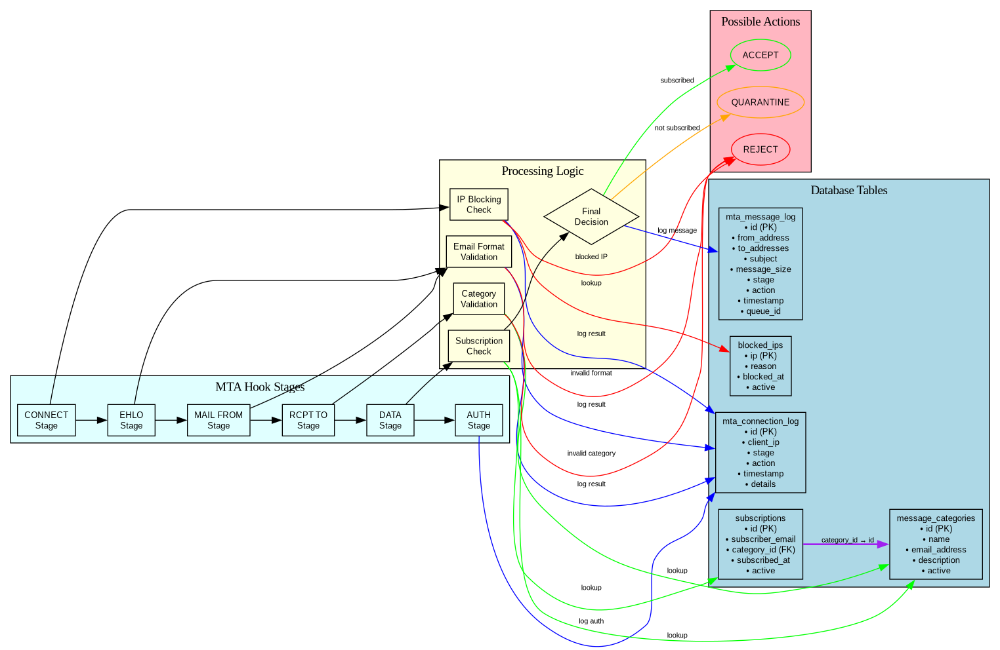
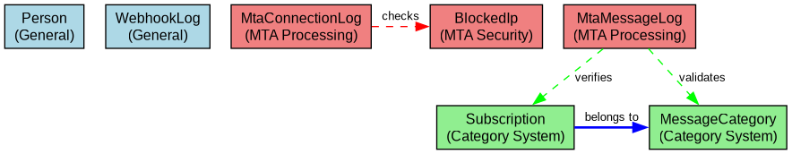

# SpacetimeDB Schema Dokumentation

Dieses Verzeichnis enthält Diagramme der Datenbankstruktur und des MTA-Hook-Verarbeitungsflusses für das Kommunikationszentrum.

## Datenbankschema-Übersicht



Das vollständige Datenbankschema zeigt alle Tabellen mit ihren Feldern, Datentypen und Beziehungen.

## MTA-Verarbeitungsfluss



Der detaillierte Ablauf der MTA-Hook-Verarbeitung von der Verbindung bis zur finalen Entscheidung.

## Vereinfachtes Entity-Relationship-Diagramm



Eine übersichtliche Darstellung der wichtigsten Entitäten und ihrer Beziehungen.

## Generierte Diagramme

### 1. Datenbankschema (`database_schema.dot`)
- **PNG**: `database_schema.png` 
- **SVG**: `database_schema.svg` (skalierbar)

Zeigt die Tabellenstruktur der SpacetimeDB mit:
- **Tabellendefinitionen** mit Feldtypen und Constraints
- **Primärschlüssel** (PK) und Auto-Increment-Felder
- **Fremdschlüsselbeziehungen** (FK)
- **Funktionale Gruppierung** der Tabellen

#### Tabellengruppen:
- **MTA Processing**: Tabellen für Mail Transfer Agent Verarbeitung
- **Category Management**: Kategorien und Abonnements
- **General**: Allgemeine Tabellen (Person, Webhook-Logs)

### 2. MTA-Verarbeitungsfluss (`mta_processing_flow.dot`)
- **PNG**: `mta_processing_flow.png` 
- **SVG**: `mta_processing_flow.svg` (skalierbar)

Zeigt den detaillierten Ablauf der MTA-Hook-Verarbeitung:
- **MTA-Stages**: Connect → EHLO → MAIL → RCPT → DATA → AUTH
- **Validierungslogik** für jede Stage
- **Datenbankinteraktionen** (Lookups und Logging)
- **Entscheidungspunkte** und mögliche Aktionen

#### Verarbeitungsschritte:
1. **CONNECT**: IP-Blocking-Check gegen `blocked_ips`
2. **EHLO/MAIL**: E-Mail-Format-Validierung
3. **RCPT**: Kategorie-Validierung gegen `message_categories`
4. **DATA**: Abonnement-Check gegen `subscriptions`
5. **Logging**: Alle Aktionen werden in entsprechende Log-Tabellen geschrieben

#### Mögliche Aktionen:
- **ACCEPT** (grün): Nachricht wird akzeptiert
- **REJECT** (rot): Nachricht wird abgelehnt
- **QUARANTINE** (orange): Nachricht wird in Quarantäne gestellt

### 3. Vereinfachtes ER-Diagramm (`simple_er_diagram.dot`)
- **PNG**: `simple_er_diagram.png` 
- **SVG**: `simple_er_diagram.svg` (skalierbar)

Eine übersichtliche Darstellung der Entitäten:
- **Farbkodierung** nach Funktionsbereichen
- **Klare Beziehungen** zwischen Tabellen
- **Reduzierte Komplexität** für schnelle Übersicht

## Datenbankstruktur im Detail

### Core Tables

#### `person`
- Allgemeine Personentabelle
- Felder: `id` (PK, auto_inc), `name`

#### `webhook_log`
- Allgemeine Webhook-Logs
- Felder: `id` (PK, auto_inc), `payload`, `processed_at`

### MTA Processing Tables

#### `mta_connection_log`
- Logs für Verbindungsebene (CONNECT, EHLO, MAIL, RCPT, AUTH)
- Felder: `id`, `client_ip`, `stage`, `action`, `timestamp`, `details`

#### `mta_message_log`
- Logs für Nachrichtenebene (DATA)
- Felder: `id`, `from_address`, `to_addresses` (JSON), `subject`, `message_size`, `stage`, `action`, `timestamp`, `queue_id`

#### `blocked_ips`
- IP-Blocking-Liste
- Felder: `ip` (PK), `reason`, `blocked_at`, `active`

### Category Management

#### `message_categories`
- E-Mail-Kategorien mit zugehörigen E-Mail-Adressen
- Felder: `id` (PK, auto_inc), `name`, `email_address`, `description`, `active`

#### `subscriptions`
- Abonnements von Sendern zu Kategorien
- Felder: `id` (PK, auto_inc), `subscriber_account_id`, `subscriber_email`, `category_id` (FK), `subscribed_at`, `active`
- **Foreign Key**: `category_id` → `message_categories.id`

## Regenerierung der Diagramme

Um die Diagramme neu zu generieren:

```bash
# PNG-Versionen
dot -Tpng database_schema.dot -o database_schema.png
dot -Tpng mta_processing_flow.dot -o mta_processing_flow.png

# SVG-Versionen (empfohlen für Web)
dot -Tsvg database_schema.dot -o database_schema.svg
dot -Tsvg mta_processing_flow.dot -o mta_processing_flow.svg
```

## Voraussetzungen

- `graphviz` muss installiert sein: `sudo apt install graphviz`

## Verwendung

Die generierten Diagramme können in:
- **Dokumentation** eingebettet werden
- **Präsentationen** verwendet werden
- **Code-Reviews** als Referenz dienen
- **Neue Entwickler** beim Onboarding helfen
